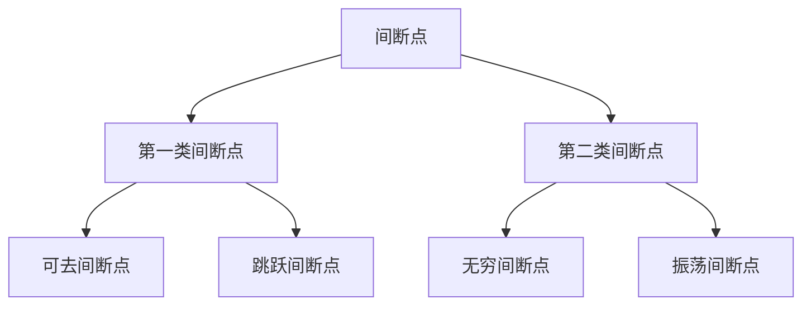

## 在 Markdown 中使用组件

本站用 [Astro](https://astro.build) 构建，内容层是 [MDX](https://docs.astro.build/zh-cn/guides/integrations-guide/mdx/)——**MDC 的继任者**：可以直接在 `.mdx` 文件里写 JSX 组件，并支持一整套 remark / rehype 扩展。

下面每个组件都有三个页签：**组件**是渲染结果、**用法**是可以直接复制的 MDX、**源码**是该组件在仓库里的真实实现——第三栏是构建时从 `src/components/` 读进来的，不是手抄的快照，因此永远与代码一致。

<Tab tabs={["组件","用法","源码"]}>

<div slot="tab1">

<LinkCard title="MDX 语法（必读）" icon="https://astro.build/favicon.svg" link="https://docs.astro.build/zh-cn/guides/integrations-guide/mdx/" className="gradient-card active" />

~~也许要翻到 [本页源码](https://github.com/PaloMiku/blog-v4/blob/main/astro-site/src/content-mdx/previews/example.mdx) 才能领会到这种语法的特性~~，现在可以在页面内看源代码了，<span className="example-info" id="just-like-this" style="color: #00bb66">就像**这样**——</span>，或是主题介绍页面的组件入口卡片那样……确定不对照源码阅读吗？

</div>

<div slot="tab2">

```mdx wrap expand
<LinkCard title="MDX 语法（必读）" icon="https://astro.build/favicon.svg" link="https://docs.astro.build/zh-cn/guides/integrations-guide/mdx/" className="gradient-card active" />

~~也许要翻到 [本页源码](https://github.com/PaloMiku/blog-v4/blob/main/astro-site/src/content-mdx/previews/example.mdx) 才能领会到这种语法的特性~~，现在可以在页面内看源代码了，<span className="example-info" id="just-like-this" style="color: #00bb66">就像**这样**——</span>，或是主题介绍页面的组件入口卡片那样……确定不对照源码阅读吗？
```

</div>

<div slot="tab3">

```astro [LinkCard.astro] source=components/content/LinkCard.astro expand
```

</div>

</Tab>

我编写了一些可以在 Markdown 文件中调用的组件，以下是一些示例。

## 通过 CSS 类名控制样式

这一节演示的是**给 Markdown 原生元素挂类名**去换样式，不是某个组件，所以只有「效果 / 写法」两栏。

<Tab tabs={["效果","写法"]}>

<div slot="tab1">

- 各级标题
  - 在 Front matter 中设置 <code lang="yaml">type: story</code> 可以换用不同样式。
  - 跟随 URL Hash（网址锚点）的高亮。
- > 引用。
- 无序和有序列表。
- **粗体**、~~删除线~~。
- 分割线。
---
- 带有 `icon` 类名的图片，如 。

- <span className="title-like">只在 <code lang="yaml">type: story</code> 时🀄</span>

- <span className="text-story">故事感。</span>

- <span className="text-repeat">阴 影 回 声</span>

- 滚动，然后悄悄<span className="text-zoom">变大变高</span>，惊艳所有人。

</div>

<div slot="tab2">

```mdx wrap expand
- 各级标题
  - 在 Front matter 中设置 <code lang="yaml">type: story</code> 可以换用不同样式。
  - 跟随 URL Hash（网址锚点）的高亮。
- > 引用。
- 无序和有序列表。
- **粗体**、~~删除线~~。
- 分割线。
---
- 带有 `icon` 类名的图片，如 。
- <span className="title-like">只在 <code lang="yaml">type: story</code> 时🀄</span>
- <span className="text-story">故事感。</span>
- <span className="text-repeat">阴 影 回 声</span>
- 滚动，然后悄悄<span className="text-zoom">变大变高</span>，惊艳所有人。
```

</div>

</Tab>

## Markdown 语法组件

可以通过 Markdown 原生语法、HTML 语法和 MDX（JSX）语法使用的组件。

### 链接 `ProseA`

[这是内部链接](#链接-prosea)。[站外链接](https://zhilu.site) 默认在新标签页打开，并在鼠标悬浮时展示域名。

还会根据域名展示图标，例如 [微软文档](https://learn.microsoft.com/zh-cn/)、[GitHub](https://github.com/)、[Bilibili](https://www.bilibili.com/)、[QQ 官网](https://im.qq.com/)、[微信公众号](https://mp.weixin.qq.com/) 等。

<Alert title="自定义图标">

  <Tab tabs={["效果","写法"]}>

  <div slot="tab1">

  你可以将 `icon` 属性指定 Iconify 图标名，例如 <a href="#链接-prosea" icon="tabler:color-swatch">a</a>。图标可在 [Iconify](https://icon-sets.iconify.design/) 或 [Yesicon](https://yesicon.app/) 搜索。

  </div>

  <div slot="tab2">

  ```mdx wrap
  你可以将 `icon` 属性指定 Iconify 图标名，例如 <a href="#链接-prosea" icon="tabler:color-swatch">a</a>。图标可在 [Iconify](https://icon-sets.iconify.design/) 或 [Yesicon](https://yesicon.app/) 搜索。
  ```

  </div>

  </Tab>

</Alert>

#### 为更多站点匹配图标

你可以在 `src/lib/shared/icon.ts` 分别为主域名或专门域名（优先级高）添加匹配规则来为更多站点匹配图标。

### 代码 `ProseCode`

`行内代码` 和 [在超链接中的 `行内代码`](#代码-prosecode)。

行内代码要带语言或按钮，得直接写 `<code>`——MDX 里没有 MDC 那种「反引号后跟 `{lang="js"}`」的属性写法。例如 <code lang="js">const a = 1</code> 。

加上 `copy` 则展示复制按钮，例如 <code lang="sh" copy={true}>pnpm dev</code> 。

### 代码块 `ProsePre`

```
纯文本代码块
```

``` [文件名]
带文件夹名、未指定语言的代码块
```

```yaml
语言: yaml # 指定语言但无文件名
```

```yaml [特别特别特别特别特别特别特别特别特别特别特别特别特别特别特别特别特别特别特别特别特别特别特别特别特别特别特别特别特别特别特别特别长的文件名]
羽化边缘: 如果一行特别特别特别特别特别特别特别特别特别特别特别特别特别特别特别特别长，溢出滚动时有羽化边缘。
```

```md [CHANGELOG.md]
# 更新日志
- 特殊文件名自动匹配图标
- 若行数超出
  `appConfig.component.codeblock.triggerRows`
  （默认32）
  - 则自动折叠到
  `appConfig.component.codeblock.collapsedRows`
  （默认16）
- 如果设置了 expand，则不会自动折叠
- 如果设置了 wrap，则会自动换行
- 如果设置了文件名，则会在代码块标题前展示图标
  - 图标只在有文件名时展示
  - 默认图标是语言图标
  - 特殊文件名也会自动识别出图标
  - 文件名可以是任意字符串，例如 `CHANGELOG.md`、`README.md` 等
  - 文件名也可以是路径，例如 `src/components/ProsePre.vue` 等
  - 还可以通过 `icon=图标` 自定义图标

\
\
\
\
\
\
\
\
\
\
\
\
\
\
\
```

````md [更多功能] icon=tabler:files wrap expand
- 在 Markdown 文件中，可以通过代码块语法的 meta 标记
  - `wrap` 直接启用自动换行功能，以展示特别特别特别特别特别特别特别特别特别特别特别特别特别特别特别特别长的文本而不换行
  - `icon=tabler:files` 自定义代码块图标
  - `expand` 禁用自动折叠功能

# 代码块语法

```语言简写 [文件名] icon=图标 wrap expand
- 上面这几项都是可选的。
- 如果有语言简写，必须位于反引号后的第一项，且需要是小写字母。
  - https://shiki.style/languages
- 方括号包裹的是文件名。
- icon=图标、wrap、expand 都是 meta 标记。
- 如果要在代码块中嵌套代码块语法，外层可以用四个反引号包裹。
```
````

#### 高亮和转换

代码块通过 Shiki 进行高亮，可在 `blog.config.ts` 中配置语言（Markdown 中出现的所有语言）和代码高亮主题。

转换器（如 diff）可通过 https://shiki.style/packages/transformers#transformers 配置，启用的转换器可在 `app/stores/shiki.ts` 查看。

#### 为更多语言匹配图标

你可以根据 `src/lib/shared/icon.ts` 语言图标匹配流程为文件后缀、语言简写或别名添加匹配规则来为更多语言匹配图标：

1. 查找 `file2icon` 映射表，将文件名后缀替换为图标名。
2. 若无匹配，查找 `ext2lang` 映射表，将语言简写或别名转换为 Catppuccin 图标库中的语言名。
3. 将 Catppuccin 图标库中的语言名转换为 Iconify 图标名。

### 表格 `ProseTable`

> 支持表格横向滚动或自动换行的切换。

| 表头滚动吸附 | 滚动时边缘羽化 | 如果标题或内容很 loooooooooooooooooooooooooooooooooooooooooooooooooooooooooooooog | 这里还有一列，但是是空内容 |
| ----------- | -------------: | :-------------------------------------------------------------------------------- | :------------------------- |
| 已实现       | 已实现         | 可以切换滚动方式                                                                  |

### 脚注

由remark-gfm的micromark-extension-gfm-footnote驱动的脚注[^micromark-extension-gfm-footnote]。

[^micromark-extension-gfm-footnote]: [README of micromark-extension-gfm-footnote](https://github.com/micromark/micromark-extension-gfm-footnote#use)

### 数学公式

> 由 remark-$\KaTeX$ 驱动，支持 $\TeX$ 和部分 $\LaTeX$ 语法。如果 Markdown 正文需要直接使用 \$ 符号，需要使用 `\$` 转义。
>
> [支持语法列表](https://katex.org/docs/supported)（[中文版](https://www.luogu.com.cn/paste/hs3jg81l)）

<Tab tabs={["组件","用法","源码"]}>

<div slot="tab1">

行内公式 $\text{课程绩点} = \frac{\text{课程分数(成绩)}}{10} - 5$

$$
\text{学分绩点} = \text{课程学分} \times \text{课程绩点}
$$

```math
\text{平均绩点(GPA)} =\frac {\text{学分绩点之和}}{\text{课程学分之和}} = \frac{\sum (\text{课程学分} \times \text{课程绩点})}{\sum \text{课程学分}}
```

$$
\raisebox{-2pt}{\colorbox{#4A90A4}{\color{white}{\Large\text{纸}}}}\kern-2pt
\raisebox{-4pt}{\colorbox{#5BA88C}{\color{white}{\large\text{鹿}}}}\kern-3pt
\raisebox{-1pt}{\colorbox{#6B8E9F}{\color{white}{\normalsize\text{至}}}}\kern-1pt
\raisebox{-3pt}{\colorbox{#A8D5E2}{\color{#2C4A52}{\large\text{麓}}}}\kern-2pt
\raisebox{0pt}{\colorbox{#B8E0D0}{\color{#2C4A52}{\normalsize\text{不}}}}\kern-3pt
\raisebox{-5pt}{\colorbox{#5A9AA8}{\color{white}{\large\text{知}}}}\kern-1pt
\raisebox{-2pt}{\colorbox{#C5E0E8}{\color{#2C4A52}{\Large\text{路}}}}
\quad
\raisebox{-4pt}{\colorbox{#5BA88C}{\color{white}{\large\text{支}}}}\kern-2pt
\raisebox{-1pt}{\colorbox{#4A90A4}{\color{white}{\Large\text{炉}}}}\kern-3pt
\raisebox{-3pt}{\colorbox{#7BC4B5}{\color{white}{\normalsize\text{制}}}}\kern-1pt
\raisebox{-5pt}{\colorbox{#A8D5E2}{\color{#2C4A52}{\large\text{麓}}}}\kern-2pt
\raisebox{-2pt}{\colorbox{#C5E0E8}{\color{#2C4A52}{\Large\text{不}}}}\kern-3pt
\raisebox{0pt}{\colorbox{#6B8E9F}{\color{white}{\normalsize\text{止}}}}\kern-1pt
\raisebox{-3pt}{\colorbox{#B8E0D0}{\color{#2C4A52}{\large\text{漉}}}}
$$

</div>

<div slot="tab2">

````mdx wrap
行内公式 $\text{课程绩点} = \frac{\text{课程分数(成绩)}}{10} - 5$

$$
\text{学分绩点} = \text{课程学分} \times \text{课程绩点}
$$

```math
\text{平均绩点(GPA)} =\frac {\text{学分绩点之和}}{\text{课程学分之和}} = \frac{\sum (\text{课程学分} \times \text{课程绩点})}{\sum \text{课程学分}}
```

$$
\raisebox{-2pt}{\colorbox{#4A90A4}{\color{white}{\Large\text{纸}}}}\kern-2pt
\raisebox{-4pt}{\colorbox{#5BA88C}{\color{white}{\large\text{鹿}}}}\kern-3pt
\raisebox{-1pt}{\colorbox{#6B8E9F}{\color{white}{\normalsize\text{至}}}}\kern-1pt
\raisebox{-3pt}{\colorbox{#A8D5E2}{\color{#2C4A52}{\large\text{麓}}}}\kern-2pt
\raisebox{0pt}{\colorbox{#B8E0D0}{\color{#2C4A52}{\normalsize\text{不}}}}\kern-3pt
\raisebox{-5pt}{\colorbox{#5A9AA8}{\color{white}{\large\text{知}}}}\kern-1pt
\raisebox{-2pt}{\colorbox{#C5E0E8}{\color{#2C4A52}{\Large\text{路}}}}
\quad
\raisebox{-4pt}{\colorbox{#5BA88C}{\color{white}{\large\text{支}}}}\kern-2pt
\raisebox{-1pt}{\colorbox{#4A90A4}{\color{white}{\Large\text{炉}}}}\kern-3pt
\raisebox{-3pt}{\colorbox{#7BC4B5}{\color{white}{\normalsize\text{制}}}}\kern-1pt
\raisebox{-5pt}{\colorbox{#A8D5E2}{\color{#2C4A52}{\large\text{麓}}}}\kern-2pt
\raisebox{-2pt}{\colorbox{#C5E0E8}{\color{#2C4A52}{\Large\text{不}}}}\kern-3pt
\raisebox{0pt}{\colorbox{#6B8E9F}{\color{white}{\normalsize\text{止}}}}\kern-1pt
\raisebox{-3pt}{\colorbox{#B8E0D0}{\color{#2C4A52}{\large\text{漉}}}}
$$
````

</div>

<div slot="tab3">

```astro [math-code.ts] source=plugins/math-code.ts expand
```

</div>

</Tab>

### 许可协议和侧栏插槽

> 由自编写的rehype-meta-slots插件实现，插槽必须是文章的直接子元素，内容已插入到文章末尾 [^copyright] 和目录侧栏。

[^copyright]: 文章末尾有特殊许可协议，还可从此处返回正文对插槽的讲解。


```mdx wrap
---
aside: [toc, meta-aside-foo, meta-aside-bar]
metaSlots:
  aside-foo:
    props:
      title: 从文章插入的组件
      card: true
    content: 展示 remark 插件能力，为用户自己编写插件提供实现思路。虽然一般情况下，<Blur>文章侧栏不需要组件</Blur>
  aside-bar:
    props: {}
    content: <LinkCard title="MDX 语法（必读）" icon="https://astro.build/favicon.svg" link="https://docs.astro.build/zh-cn/guides/integrations-guide/mdx/" />
  copyright:
    props:
      title: 本文章不保留版权
    content: 通过 <a href="https://creativecommons.org/publicdomain/zero/1.0/deed.zh-hans" icon="ri:creative-commons-zero-line">CC0 1.0</a> 贡献至公共领域。
---
```

> ⚠️ `content` 里放的是**MDX 源码字符串**，不是 MDC 块语法。它由 `src/lib/meta-slot.ts` 解析成节点树后走真实组件渲染——**不能**用 `set:html` 直接吐出去，否则 `<LinkCard />` 会变成浏览器不认识的未知元素、整个 widget 空白（而页高、计算样式两道门禁都看不见它）。
> 上面这段就是**本页自己的 frontmatter**，可以逐字对照。

### 乐谱渲染播放

> 由自编写的remark-code-component插件实现，必要时可用豆包等 AI 将乐谱识别为 ABC 记法。只在网络状态良好时加载播放能力。
>
> 编辑器、Cheat Sheet 和语法检查：https://editor.drawthedots.com/

<Tab tabs={["组件","用法","源码"]}>

<div slot="tab1">

<MusicScore abc={`L:1/8
Q:1/4=100 "andante moderato"
M:2/4
K:D
"D" FA A>B | AF DD/E/ |1 "G" FF ED | "A" E2 z2 :|2 "G" FF "A" EE | "D" D2 z2 ||`} />

<MusicScore abc={`L:1/8
Q:1/4=100
M:2/4
K:D
V:1 clef=treble
V:2 clef=bass
%%MIDI program 32
[V:1] z2 z f/g/ | aa a>b | af dd/e/ | ff ee | d2 z2 || FA A>B | AF DD/E/ |
w: | | | | | 你 爱 我 | 我 爱 你 蜜 雪
[V:2] z4 | D,[F,A,] .A,[F,A,] | .D,[F,A,] .A,[E,A,] | .G,,[G,D,] .A,,[E,A,] | .D,[F,A,] [D,,D,]2 || .D,,[D,F,] .A,,[D,F,] | .D,,[D,F,] .A,,[D,F,] |
[V:1] FF ED | E2 z2 | FA A>B | AF DD/E/ | FF EE | D2 z2 | G2 G2 |
w: 冰 城 甜 蜜 | 蜜 | 你 爱 我 | 我 爱 你 蜜 雪 冰 城 甜 蜜 | 蜜 | 你 爱
[V:2] .G,,[B,G,] .D,[B,G,] | .A,,[A,C] .E,[A,C] | .D,,[D,F,] .A,,[D,F,] | .D,,[D,F,] .A,,[D,F,] | .G,,[G,D,] .A,,[E,A,] | .D,,[A,,D,] .[A,,D,]2 | .G,,[B,G,] .D,[B,G,] |
[V:1] GB z2 | A2 AF | E2 z2 | FA A>B | AF DD/E/ | FF EE | D2 z2 |]
w: 我 呀 | 我 爱 | 你 | 你 爱 我 | 我 爱 你 蜜 雪 冰 城 甜 蜜 | 蜜
[V:2] .G,,[B,G,] .D,[B,G,] | .D,,[F,D,] .A,,[F,D,] | .A,,[A,C] .E,[A,C] | .D,,[F,D,] .A,,[F,D,] | .D,,[F,D,] .A,,[F,D,] | .G,,[G,D,] .A,,[E,A,] | .D,.A,, [D,,D,]2 |]`} />

</div>

<div slot="tab2">

````mdx wrap expand
```music-abc
L:1/8
Q:1/4=100 "andante moderato"
M:2/4
K:D
"D" FA A>B | AF DD/E/ |1 "G" FF ED | "A" E2 z2 :|2 "G" FF "A" EE | "D" D2 z2 ||
```

```music-abc
L:1/8
Q:1/4=100
M:2/4
K:D
V:1 clef=treble
V:2 clef=bass
%%MIDI program 32
[V:1] z2 z f/g/ | aa a>b | af dd/e/ | ff ee | d2 z2 || FA A>B | AF DD/E/ |
w: | | | | | 你 爱 我 | 我 爱 你 蜜 雪
[V:2] z4 | D,[F,A,] .A,[F,A,] | .D,[F,A,] .A,[E,A,] | .G,,[G,D,] .A,,[E,A,] | .D,[F,A,] [D,,D,]2 || .D,,[D,F,] .A,,[D,F,] | .D,,[D,F,] .A,,[D,F,] |
[V:1] FF ED | E2 z2 | FA A>B | AF DD/E/ | FF EE | D2 z2 | G2 G2 |
w: 冰 城 甜 蜜 | 蜜 | 你 爱 我 | 我 爱 你 蜜 雪 冰 城 甜 蜜 | 蜜 | 你 爱
[V:2] .G,,[B,G,] .D,[B,G,] | .A,,[A,C] .E,[A,C] | .D,,[D,F,] .A,,[D,F,] | .D,,[D,F,] .A,,[D,F,] | .G,,[G,D,] .A,,[E,A,] | .D,,[A,,D,] .[A,,D,]2 | .G,,[B,G,] .D,[B,G,] |
[V:1] GB z2 | A2 AF | E2 z2 | FA A>B | AF DD/E/ | FF EE | D2 z2 |]
w: 我 呀 | 我 爱 | 你 | 你 爱 我 | 我 爱 你 蜜 雪 冰 城 甜 蜜 | 蜜
[V:2] .G,,[B,G,] .D,[B,G,] | .D,,[F,D,] .A,,[F,D,] | .A,,[A,C] .E,[A,C] | .D,,[F,D,] .A,,[F,D,] | .D,,[F,D,] .A,,[F,D,] | .G,,[G,D,] .A,,[E,A,] | .D,.A,, [D,,D,]2 |]
```
````

</div>

<div slot="tab3">

```astro [MusicScore.astro] source=components/content/MusicScore.astro expand
```

</div>

</Tab>

### 图表渲染

> 由自编写的remark-code-component插件实现，语法参见 [Mermaid 文档](https://mermaid.js.org/intro/syntax-reference.html)。图表跟随亮暗色模式重绘，进入视口附近才会加载渲染器。超宽图表可横向滚动，悬停或点击图表可切换为适应宽度。

<Tab tabs={["组件","用法","源码"]}>

<div slot="tab1">

<Mermaid code={`graph TD
    A[间断点] --> B[第一类间断点]
    A --> C[第二类间断点]

    B --> B1[可去间断点]
    B --> B2[跳跃间断点]

    C --> C1[无穷间断点]
    C --> C2[振荡间断点]`} />

</div>

<div slot="tab2">

````mdx wrap expand

````

</div>

<div slot="tab3">

```astro [Mermaid.astro] source=components/content/Mermaid.astro expand
```

</div>

</Tab>

## 自定义组件

只属于 MDX 的组件：直接写在 `.mdx` 里的 JSX，没有 Markdown 原生写法。

### Alert

<Tab tabs={["组件","用法","源码"]}>

<div slot="tab1">

  <Alert>

  你好

  </Alert>

  <Alert type="question">

  默认插槽的 [超链接](#alert) **粗体** `Inline code`

  </Alert>

  <Alert type="info" title="自定义标题">

  默认插槽的 [超链接](#alert) **粗体** `Inline code`

  </Alert>

  <Alert type="warning" card={true}>

  <Fragment slot="title">

  卡片风格 标题插槽的 [超链接](#alert) **粗体** `Inline code`

  </Fragment>

  默认插槽的 [超链接](#alert) **粗体** `Inline code`

  </Alert>

  <Alert type="error" flat={true}>

  <Fragment slot="title">

  扁平风格 标题插槽的 [超链接](#alert) **粗体** `Inline code`

  </Fragment>

  默认插槽的 [超链接](#alert) **粗体** `Inline code`

  </Alert>

  <Alert icon="tabler:files" color="var(--c-accent)" title="仅标题，并且自定义图标和颜色" />

</div>

<div slot="tab2">

```mdx wrap expand
<Alert>

你好

</Alert>

<Alert type="question">

默认插槽的 [超链接](#alert) **粗体** `Inline code`

</Alert>

<Alert type="info" title="自定义标题">

默认插槽的 [超链接](#alert) **粗体** `Inline code`

</Alert>

<Alert type="warning" card={true}>

<Fragment slot="title">

卡片风格 标题插槽的 [超链接](#alert) **粗体** `Inline code`

</Fragment>

默认插槽的 [超链接](#alert) **粗体** `Inline code`

</Alert>

<Alert type="error" flat={true}>

<Fragment slot="title">

扁平风格 标题插槽的 [超链接](#alert) **粗体** `Inline code`

</Fragment>

默认插槽的 [超链接](#alert) **粗体** `Inline code`

</Alert>

<Alert icon="tabler:files" color="var(--c-accent)" title="仅标题，并且自定义图标和颜色" />
```

</div>

<div slot="tab3">

```astro [Alert.astro] source=components/content/Alert.astro expand
```

</div>

</Tab>

### Badge

<Tab tabs={["组件","用法","源码"]}>

<div slot="tab1">
<Badge link="#badge">普通带链接</Badge> <Badge round={true}>纯文本指定圆形</Badge> <Badge square={true}>纯文本指定方形</Badge> <Badge img="https://picsum.photos/100/100">带个图</Badge>

外部域名自动获取站点图标 <Badge link="https://www.zhilu.site">纸鹿</Badge>，
<Badge link="https://gug.thisis.host/" square={true}>古怪杂记本</Badge>，
GitHub链接能自动识别头像 <Badge link="https://github.com/KazariEX">KazariEX</Badge>，
也可指定方形 <Badge square={true} link="https://github.com/isYangs/GioPic">isYangs/GioPic</Badge>。

<Alert>

<Fragment slot="title">

在其他组件中使用 <Badge img="https://picsum.photos/100/100" text="带链接" link="#badge" />

</Fragment>

<Badge img="https://picsum.photos/100/100" text="指定圆形" round={true} /> 背景色 [可以 <Badge img="https://picsum.photos/100/100" text="动态变化" square={true} /> 使用](#badge)

</Alert>
</div>

<div slot="tab2">

```mdx wrap expand
<Badge link="#badge">普通带链接</Badge> <Badge round={true}>纯文本指定圆形</Badge> <Badge square={true}>纯文本指定方形</Badge> <Badge img="https://picsum.photos/100/100">带个图</Badge>

外部域名自动获取站点图标 <Badge link="https://www.zhilu.site">纸鹿</Badge>，
<Badge link="https://gug.thisis.host/" square={true}>古怪杂记本</Badge>，
GitHub链接能自动识别头像 <Badge link="https://github.com/KazariEX">KazariEX</Badge>，
也可指定方形 <Badge square={true} link="https://github.com/isYangs/GioPic">isYangs/GioPic</Badge>。

<Alert>

<Fragment slot="title">

在其他组件中使用 <Badge img="https://picsum.photos/100/100" text="带链接" link="#badge" />

</Fragment>

<Badge img="https://picsum.photos/100/100" text="指定圆形" round={true} /> 背景色 [可以 <Badge img="https://picsum.photos/100/100" text="动态变化" square={true} /> 使用](#badge)

</Alert>
```

</div>

<div slot="tab3">

```astro [Badge.astro] source=components/content/Badge.astro expand
```

</div>

</Tab>

### BlogHeader

<Tab tabs={["组件","用法","源码"]}>

<div slot="tab1">
<BlogHeader />
</div>

<div slot="tab2">

```mdx wrap expand
<BlogHeader />
```

</div>

<div slot="tab3">

```astro [BlogHeader.astro] source=components/blog/BlogHeader.astro expand
```

</div>

</Tab>

```sh wrap
# iconfont 网页版生成的字体子集在 Chrome 124 的版本无法解析，需要借助 fonttools 工具手动生成子集
pip install fonttools brotli
pyftsubset ./AlimamaFangYuanTi.ttf --text=Header文本 --flavor=woff2
```

### <Blur>Blur</Blur>

<Tab tabs={["组件","用法","源码"]}>

<div slot="tab1">
<Blur>你知道得太多了。</Blur>

<Blur>

<Quote>

也未必。

</Quote>

</Blur>
</div>

<div slot="tab2">

```mdx wrap expand
<Blur>你知道得太多了。</Blur>

<Blur>

<Quote>

也未必。

</Quote>

</Blur>
```

</div>

<div slot="tab3">

```astro [Blur.astro] source=components/content/Blur.astro expand
```

</div>

</Tab>

### CardList

> 给列表刷上了自定义样式，待完善。

<Tab tabs={["组件","用法","源码"]}>

<div slot="tab1">
<CardList>

- 无序列表项1
- 无序列表项2
  - 无序列表项2-1
    - 无序列表项2-1-1
  - 无序列表项2-2

</CardList>
</div>

<div slot="tab2">

```mdx wrap expand
<CardList>

- 无序列表项1
- 无序列表项2
  - 无序列表项2-1
    - 无序列表项2-1-1
  - 无序列表项2-2

</CardList>
```

</div>

<div slot="tab3">

```astro [CardList.astro] source=components/content/CardList.astro expand
```

</div>

</Tab>

### Chat

<Tab tabs={["组件","用法","源码"]}>

<div slot="tab1">
<Chat items={[
	{ caption: "2024-11-09 23:39:30", control: ":", body: "" },
	{ caption: "", control: ".", body: "也许" },
	{ caption: "", control: ".", body: "我们可以聊聊天" },
	{ caption: "纸鹿", control: ".", body: "我还可以有名字" },
	{ caption: "纸鹿撤回了一条消息", control: ":", body: "" },
	{ caption: "用户1", body: "有趣\n我学到了。" }
]} />
</div>

<div slot="tab2">

```mdx wrap expand
<Chat items={[
	{ caption: "2024-11-09 23:39:30", control: ":", body: "" },
	{ caption: "", control: ".", body: "也许" },
	{ caption: "", control: ".", body: "我们可以聊聊天" },
	{ caption: "纸鹿", control: ".", body: "我还可以有名字" },
	{ caption: "纸鹿撤回了一条消息", control: ":", body: "" },
	{ caption: "用户1", body: "有趣\n我学到了。" }
]} />
```

</div>

<div slot="tab3">

```astro [Chat.astro] source=components/content/Chat.astro expand
```

</div>

</Tab>

### Copy

<Tab tabs={["组件","用法","源码"]}>

<div slot="tab1">
<Copy code="rm -rf # 修改命令后再复制，也可撤销修改" />

<Copy prompt={true} code="不带提示符的命令，可以是 URL、单行代码" />

<Copy prompt="自定义命令提示符、高亮语言" lang="js" code="const customLang = 'js' // 滚动条、边缘羽化会出现，假如它特别特别特别特别特别特别特别特别长" />
</div>

<div slot="tab2">

```mdx wrap expand
<Copy code="rm -rf # 修改命令后再复制，也可撤销修改" />

<Copy prompt={true} code="不带提示符的命令，可以是 URL、单行代码" />

<Copy prompt="自定义命令提示符、高亮语言" lang="js" code="const customLang = 'js' // 滚动条、边缘羽化会出现，假如它特别特别特别特别特别特别特别特别长" />
```

</div>

<div slot="tab3">

```astro [Copy.astro] source=components/content/Copy.astro expand
```

</div>

</Tab>

#### 自动推断语言

语言从 `src/lib/shared/str.ts` 的 `getPromptLanguage` 里根据命令提示符前缀推断，使用 [plain-shiki](https://github.com/KazariEX/plain-shiki) 高亮。和之前的 Markdown 代码块使用相同的高亮语言和高亮主题配置。

### EmojiClock

> 现在几点了？

<Tab tabs={["组件","用法","源码"]}>

<div slot="tab1">
<EmojiClock /> (半小时) <EmojiClock rotate={true} /> (5分钟) <EmojiClock datetime="2024-11-09 23:39:30" /> (指定时间)
</div>

<div slot="tab2">

```mdx wrap expand
<EmojiClock /> (半小时) <EmojiClock rotate={true} /> (5分钟) <EmojiClock datetime="2024-11-09 23:39:30" /> (指定时间)
```

</div>

<div slot="tab3">

```astro [EmojiClock.astro] source=components/content/EmojiClock.astro expand
```

</div>

</Tab>

### FeedCard 和 FeedGroup

> 用于在友链页面展示链接，由于友链页面的 Markdown 部分要可能会显示这个组件，就放在这个目录下大家都能调用了。去友链页面看看吧。

### Folding

> 折叠组件，支持折叠和展开，可以嵌套使用。

<Tab tabs={["组件","用法","源码"]}>

<div slot="tab1">
  <Folding>

  <Fragment slot="title">

  可以通过标题插槽传值 [超链接](#folding) **粗体** `Inline code`

  </Fragment>

  默认插槽的 [超链接](#folding) **粗体** `Inline code`

    <Folding open={true} title="折叠还可以嵌套">

    默认展开的折叠。

      <Alert type="error">

      <Fragment slot="title">

      在嵌套使用的组件内部使用 MDX 的具名插槽（`<Fragment slot="title">`）

      </Fragment>

      必须缩进，否则会报错。

      </Alert>

    </Folding>

  </Folding>

<Folding open={true}>

```md
- 默认展开的折叠。
```

</Folding>
</div>

<div slot="tab2">

````mdx wrap expand
  <Folding>

  <Fragment slot="title">

  可以通过标题插槽传值 [超链接](#folding) **粗体** `Inline code`

  </Fragment>

  默认插槽的 [超链接](#folding) **粗体** `Inline code`

    <Folding open={true} title="折叠还可以嵌套">

    默认展开的折叠。

      <Alert type="error">

      <Fragment slot="title">

      在嵌套使用的组件内部使用 MDX 的具名插槽（`<Fragment slot="title">`）

      </Fragment>

      必须缩进，否则会报错。

      </Alert>

    </Folding>

  </Folding>

<Folding open={true}>

```md
- 默认展开的折叠。
```

</Folding>
````

</div>

<div slot="tab3">

```astro [Folding.astro] source=components/content/Folding.astro expand
```

</div>

</Tab>

### Key

> 按下键时会亮，可以通过 `@press` 配置触发事件，鼠标点击也会触发事件，博客全站搜索框的按键提示使用了这个组件。

<Tab tabs={["组件","用法","源码"]}>

<div slot="tab1">
- 纯 Code

  <Key code="Escape" /> <Key code="F2" /> <Key code="Control" /> <Key code="A" /> <Key code=" " /> <Key code="Tab" /> <Key code="Enter" />

- 指定修饰符、图标、文本（macOS 自动使用图标）

  <Key code="Control" icon={true} /> <Key alt={true} icon={true} /> <Key shift={true} icon={true} /> <Key code=" " text="空格" /> <Key code="Tab" icon={true} /> <Key code="Enter" icon={true} />

- 组合键

  <Key code="A" ctrl={true} shift={true} /> <Key alt={true} shift={true} /> <Key code="Escape" ctrl={true} alt={true} icon={true} />

~~热血组合技 <Key code="ArrowUp" /> <Key code="ArrowUp" /> <Key code="ArrowDown" /> <Key code="ArrowDown" /> <Key code="ArrowLeft" /> <Key code="ArrowRight" /> <Key code="ArrowLeft" /> <Key code="ArrowRight" /> <Key code="B" /> <Key code="A" />~~
</div>

<div slot="tab2">

```mdx wrap expand
- 纯 Code

  <Key code="Escape" /> <Key code="F2" /> <Key code="Control" /> <Key code="A" /> <Key code=" " /> <Key code="Tab" /> <Key code="Enter" />

- 指定修饰符、图标、文本（macOS 自动使用图标）

  <Key code="Control" icon={true} /> <Key alt={true} icon={true} /> <Key shift={true} icon={true} /> <Key code=" " text="空格" /> <Key code="Tab" icon={true} /> <Key code="Enter" icon={true} />

- 组合键

  <Key code="A" ctrl={true} shift={true} /> <Key alt={true} shift={true} /> <Key code="Escape" ctrl={true} alt={true} icon={true} />

~~热血组合技 <Key code="ArrowUp" /> <Key code="ArrowUp" /> <Key code="ArrowDown" /> <Key code="ArrowDown" /> <Key code="ArrowLeft" /> <Key code="ArrowRight" /> <Key code="ArrowLeft" /> <Key code="ArrowRight" /> <Key code="B" /> <Key code="A" />~~
```

</div>

<div slot="tab3">

```astro [Key.astro] source=components/content/Key.astro expand
```

</div>

</Tab>

### LinkBanner

<Tab tabs={["组件","用法","源码"]}>

<div slot="tab1">
<LinkBanner banner="https://picsum.photos/480/240" title="标题" description="这是一行描述，如果不提供描述会展示域名" link="#link-banner" />
</div>

<div slot="tab2">

```mdx wrap expand
<LinkBanner banner="https://picsum.photos/480/240" title="标题" description="这是一行描述，如果不提供描述会展示域名" link="#link-banner" />
```

</div>

<div slot="tab3">

```astro [LinkBanner.astro] source=components/content/LinkBanner.astro expand
```

</div>

</Tab>

### LinkCard

<Tab tabs={["组件","用法","源码"]}>

<div slot="tab1">
<LinkCard icon="https://picsum.photos/100/100" title="标题" description="这是一行描述，如果不提供描述会展示域名" link="#link-card" />
</div>

<div slot="tab2">

```mdx wrap expand
<LinkCard icon="https://picsum.photos/100/100" title="标题" description="这是一行描述，如果不提供描述会展示域名" link="#link-card" />
```

</div>

<div slot="tab3">

```astro [LinkCard.astro] source=components/content/LinkCard.astro expand
```

</div>

</Tab>

### Pic

> 用于展示图片，支持说明文字、点击后打开灯箱缩放。

<Tab tabs={["组件","用法","源码"]}>

<div slot="tab1">
<Pic src="https://picsum.photos/480/240" caption="说明文字，还支持通过 width 或 height 属性指定尺寸" />
</div>

<div slot="tab2">

```mdx wrap expand
<Pic src="https://picsum.photos/480/240" caption="说明文字，还支持通过 width 或 height 属性指定尺寸" />
```

</div>

<div slot="tab3">

```astro [Pic.astro] source=components/content/Pic.astro expand
```

</div>

</Tab>

### Poetry

> 在文章的 type 为 `tech` 或 `story` 时，它有不同的样式。

<Tab tabs={["组件","用法","源码"]}>

<div slot="tab1">
<Poetry title="诗有诗的标题" author="一名作者" footer="可选的落款">

如你所见，
我,
是一首——
*诗*。

</Poetry>
</div>

<div slot="tab2">

```mdx wrap expand
<Poetry title="诗有诗的标题" author="一名作者" footer="可选的落款">

如你所见，
我,
是一首——
*诗*。

</Poetry>
```

</div>

<div slot="tab3">

```astro [Poetry.astro] source=components/content/Poetry.astro expand
```

</div>

</Tab>

### Quote

> 在文章的 type 为 `tech` 或 `story` 时，它有不同的样式。

<Tab tabs={["组件","用法","源码"]}>

<div slot="tab1">
<Quote>有时候，有些话，有点意思。</Quote>

<Quote icon="tabler:files">

令图标有所指，引用亦有中心。

</Quote>

<Quote>

<Fragment slot="icon">

ヾ(•ω•`)o

</Fragment>

图标插槽也可以是 Emoji 或颜文字，或者英文装饰。

</Quote>
</div>

<div slot="tab2">

```mdx wrap expand
<Quote>有时候，有些话，有点意思。</Quote>

<Quote icon="tabler:files">

令图标有所指，引用亦有中心。

</Quote>

<Quote>

<Fragment slot="icon">

ヾ(•ω•`)o

</Fragment>

图标插槽也可以是 Emoji 或颜文字，或者英文装饰。

</Quote>
```

</div>

<div slot="tab3">

```astro [Quote.astro] source=components/content/Quote.astro expand
```

</div>

</Tab>

### ProjectGroup

> 用于展示项目卡片列表，支持 Iconify 图标名和 URL 图片，点击可跳转到外部链接。支持响应式布局。

<Tab tabs={["组件","用法","源码"]}>

<div slot="tab1">
<ProjectGroup title="开发工具" items={[{"title":"VS Code","description":"IDE","icon":"devicon:vscode","link":"https://code.visualstudio.com/"},{"title":"PyCharm","description":"IDE","icon":"devicon:pycharm","link":"https://www.jetbrains.com/pycharm/"},{"title":"WebStorm","description":"IDE","icon":"devicon:webstorm","link":"https://www.jetbrains.com/webstorm/"}]} />

<ProjectGroup title="框架" items={[{"title":"Vue","description":"渐进式 JavaScript 框架","icon":"devicon:vuejs","link":"https://vuejs.org/"},{"title":"Nuxt","description":"Vue 全栈框架","icon":"devicon:nuxtjs","link":"https://nuxt.com/"},{"title":"React","description":"用于构建用户界面的库","icon":"devicon:react","link":"https://react.dev/"}]} />
</div>

<div slot="tab2">

```mdx wrap expand
<ProjectGroup title="开发工具" items={[{"title":"VS Code","description":"IDE","icon":"devicon:vscode","link":"https://code.visualstudio.com/"},{"title":"PyCharm","description":"IDE","icon":"devicon:pycharm","link":"https://www.jetbrains.com/pycharm/"},{"title":"WebStorm","description":"IDE","icon":"devicon:webstorm","link":"https://www.jetbrains.com/webstorm/"}]} />

<ProjectGroup title="框架" items={[{"title":"Vue","description":"渐进式 JavaScript 框架","icon":"devicon:vuejs","link":"https://vuejs.org/"},{"title":"Nuxt","description":"Vue 全栈框架","icon":"devicon:nuxtjs","link":"https://nuxt.com/"},{"title":"React","description":"用于构建用户界面的库","icon":"devicon:react","link":"https://react.dev/"}]} />
```

</div>

<div slot="tab3">

```astro [ProjectGroup.astro] source=components/content/ProjectGroup.astro expand
```

</div>

</Tab>

### SeriesGroup

> 展示单一系列的整合卡片组件，用于展示一个完整的系列。支持多张封面图的展开显示，卡片上方为图片区域，下方为系列信息。

<Tab tabs={["组件","用法","源码"]}>

<div slot="tab1">
<SeriesGroup title="苍之彼方的四重奏 系列" description="《苍之彼方的四重奏》，《苍之彼方的四重奏 Extra 1》，《苍之彼方的四重奏 Extra 2》" cover={["https://shared.fastly.steamstatic.com/store_item_assets/steam/apps/1044620/header_schinese.jpg","https://shared.fastly.steamstatic.com/store_item_assets/steam/apps/1340130/header_schinese.jpg","https://shared.akamai.steamstatic.com/store_item_assets/steam/apps/2206340/header_schinese.jpg"]} count={3} link="/games/galgames/aokana" />
</div>

<div slot="tab2">

```mdx wrap expand
<SeriesGroup title="苍之彼方的四重奏 系列" description="《苍之彼方的四重奏》，《苍之彼方的四重奏 Extra 1》，《苍之彼方的四重奏 Extra 2》" cover={["https://shared.fastly.steamstatic.com/store_item_assets/steam/apps/1044620/header_schinese.jpg","https://shared.fastly.steamstatic.com/store_item_assets/steam/apps/1340130/header_schinese.jpg","https://shared.akamai.steamstatic.com/store_item_assets/steam/apps/2206340/header_schinese.jpg"]} count={3} link="/games/galgames/aokana" />
```

</div>

<div slot="tab3">

```astro [SeriesGroup.astro] source=components/content/SeriesGroup.astro expand
```

</div>

</Tab>

### Tab

> Tab 组件支持两种样式：默认的标签栏样式和下拉框样式。

<Tab tabs={["组件","用法","源码"]}>

<div slot="tab1">

<Tab tabs={["一个简单的", "Tab"]}>

<div slot="tab1">

```md
# 一个简单的 Tab
```

</div>

<div slot="tab2">

```md
# Tab
```

</div>

</Tab>

<Tab tabs={["当当当","高级交互！","就是藏得有点深"]} center={true} active={2}>

<div slot="tab1">

这个组件设置了居中（自动调整而不是占满宽度）和默认显示第二个选项卡。

</div>

<div slot="tab2">

```md
是这样。
```

</div>

<div slot="tab3">

你找到我了吗？

</div>

</Tab>

<Tab tabs={["HTML","CSS","JavaScript"]} border={true}>

<div slot="tab1">

HTML 是网页的基础标记语言，定义了网页的结构。

</div>

<div slot="tab2">

CSS 用于定义网页的样式和布局，使网页美观。

</div>

<div slot="tab3">

JavaScript 是一种编程语言，为网页增加交互功能。

</div>

</Tab>

<Tab tabs={["React","Vue","Angular"]} combobox={true} border={true}>

<div slot="tab1">

React 是一个由 Facebook 开发的 JavaScript 库，用于构建用户界面。

</div>

<div slot="tab2">

Vue 是一个渐进式 JavaScript 框架，易于上手且功能强大。

</div>

<div slot="tab3">

Angular 是一个由 Google 开发的完整前端框架，适合大型应用。

</div>

</Tab>

</div>

<div slot="tab2">

````mdx wrap expand
#### 标签栏样式（默认）

<Tab tabs={["一个简单的", "Tab"]}>

<div slot="tab1">

```md
# 一个简单的 Tab
```

</div>

<div slot="tab2">

```md
# Tab
```

</div>

</Tab>

<Tab tabs={["当当当", "高级交互！", "就是藏得有点深"]} center={true} active={2}>

<div slot="tab1">

这个组件设置了居中（自动调整而不是占满宽度）和默认显示第二个选项卡（`active`，从 1 开始）。

</div>

<div slot="tab2">

```md
是这样。
```

</div>

<div slot="tab3">

你找到我了吗？

</div>

</Tab>

<Tab tabs={["HTML", "CSS", "JavaScript"]} border={true}>

<div slot="tab1">

HTML 是网页的基础标记语言，定义了网页的结构。

</div>

<div slot="tab2">

CSS 用于定义网页的样式和布局，使网页美观。

</div>

<div slot="tab3">

JavaScript 是一种编程语言，为网页增加交互功能。

</div>

</Tab>

<Tab tabs={["React", "Vue", "Angular"]} combobox={true} border={true}>

<div slot="tab1">

React 是一个由 Facebook 开发的 JavaScript 库，用于构建用户界面。

</div>

<div slot="tab2">

Vue 是一个渐进式 JavaScript 框架，易于上手且功能强大。

</div>

<div slot="tab3">

Angular 是一个由 Google 开发的完整前端框架，适合大型应用。

</div>

</Tab>
````

</div>

<div slot="tab3">

```astro [Tab.astro] source=components/content/Tab.astro expand
```

</div>

</Tab>

### Timeline

<Tab tabs={["组件","用法","源码"]}>

<div slot="tab1">
<Timeline items={[
	{ caption: "前天", body: "看到了小兔" },
	{ caption: "昨天", body: "是小鹿" },
	{ caption: "今天", body: "是你。" }
]} />

<Timeline items={[
	{ caption: "今日无事", body: "" },
	{ caption: "今日依旧无事", body: "" },
	{ caption: "然后——", body: "一件事\n两件事。\n\n*再添一笔*。" }
]} />
</div>

<div slot="tab2">

```mdx wrap expand
<Timeline items={[
	{ caption: "前天", body: "看到了小兔" },
	{ caption: "昨天", body: "是小鹿" },
	{ caption: "今天", body: "是你。" }
]} />

<Timeline items={[
	{ caption: "今日无事", body: "" },
	{ caption: "今日依旧无事", body: "" },
	{ caption: "然后——", body: "一件事\n两件事。\n\n*再添一笔*。" }
]} />
```

</div>

<div slot="tab3">

```astro [Timeline.astro] source=components/content/Timeline.astro expand
```

</div>

</Tab>

### Tip

<Tab tabs={["组件","用法","源码"]}>

<div slot="tab1">
<Tip tip="提示的内容是提示">我是一条小提示</Tip>， <Tip icon={true} tip="或许也可以没有内容">我没有图标</Tip>
</div>

<div slot="tab2">

```mdx wrap expand
<Tip tip="提示的内容是提示">我是一条小提示</Tip>， <Tip icon={true} tip="或许也可以没有内容">我没有图标</Tip>
```

</div>

<div slot="tab3">

```astro [Tip.astro] source=components/content/Tip.astro expand
```

</div>

</Tab>

### VideoEmbed

> 放点视频给你看。

<Tab tabs={["组件","用法","源码"]}>

<div slot="tab1">
<VideoEmbed type="raw" id="https://sf-atsx-tob.larksuite.com/obj/static-atsx-online-sg-ee-tob-mycis/02c7da694d343896877c09de9db4fc42/8ede49e0a92f53cdafbbf49339194986d9d900fb2abe242b9a8b4e338bf18b05.mp4" poster="https://sf-atsx-tob.larksuite.com/obj/static-atsx-online-sg-ee-tob-mycis/02c7da694d343896877c09de9db4fc42/e23074879c61a4d61e905ccef5771a36a2d19689c1204c2b32caa53711ac83ad.png" />

<VideoEmbed type="bilibili" id="BV1Yr421p7rW" />

<VideoEmbed type="douyin-wide" id="7339041157571169546" />

<VideoEmbed type="douyin" id="7222222794333998392" />
</div>

<div slot="tab2">

```mdx wrap expand
<VideoEmbed type="raw" id="https://sf-atsx-tob.larksuite.com/obj/static-atsx-online-sg-ee-tob-mycis/02c7da694d343896877c09de9db4fc42/8ede49e0a92f53cdafbbf49339194986d9d900fb2abe242b9a8b4e338bf18b05.mp4" poster="https://sf-atsx-tob.larksuite.com/obj/static-atsx-online-sg-ee-tob-mycis/02c7da694d343896877c09de9db4fc42/e23074879c61a4d61e905ccef5771a36a2d19689c1204c2b32caa53711ac83ad.png" />

<VideoEmbed type="bilibili" id="BV1Yr421p7rW" />

<VideoEmbed type="douyin-wide" id="7339041157571169546" />

<VideoEmbed type="douyin" id="7222222794333998392" />
```

</div>

<div slot="tab3">

```astro [VideoEmbed.astro] source=components/content/VideoEmbed.astro expand
```

</div>

</Tab>

### Music

> 左 Logo + 右信息，单行音乐跳转条。

<Tab tabs={["组件","用法","源码"]}>

<div slot="tab1">
<Music url="https://music.163.com/#/song?id=1303019256" title="何度" artist="陈奕迅" />
</div>

<div slot="tab2">

```mdx wrap expand
<Music url="https://music.163.com/#/song?id=1303019256" title="何度" artist="陈奕迅" />
```

</div>

<div slot="tab3">

```astro [Music.astro] source=components/content/Music.astro expand
```

</div>

</Tab>